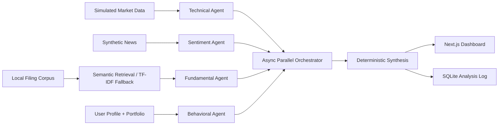

# FinSync Intelligence

FinSync Intelligence is a local-first, multi-agent financial research application for retail investors. It combines current or visibly simulated market data, local evidence, and a stored investor profile into a traceable educational report. It does not provide trading execution, direct buy/sell instructions, or guaranteed outcomes.

## Problem and solution

Retail investors often see isolated price signals without the evidence, conflicts, suitability context, or data-quality limitations behind them. FinSync runs four independent agents concurrently, uses local semantic embeddings when a cached model is available, falls back explicitly to TF-IDF, preserves every agent result, and synthesizes only cited evidence. Optional LLM and live-market modes never replace the reliable offline demonstration.

The `agents` array remains the stable four-agent frontend contract. `analytical_units` is additive and records all 12 A–Z units: the four original specialists; concurrent Regulatory, Macro/Regime, and Portfolio Risk specialists; Devil's Advocate, Missing Information, Evidence Verification, and Committee/Conflict review; and bounded Synthesis. Unavailable benchmark or regulatory material produces `insufficient_data` rather than inferred facts.

## Architecture and data flow



1. The frontend saves a risk profile, portfolio, watchlist, and interaction context.
2. The API validates the stored user and selected symbol.
3. Local market, news, and filing fixtures are loaded without filling missing values.
4. Four deterministic base agents run through `asyncio.gather()` with timestamps, latency, evidence IDs, and per-agent failure isolation. If configured, bounded LLM refinement is validated back through the same Pydantic contract.
5. Filing queries retrieve traceable semantic chunks for revenue, profitability, debt, guidance, and risk. If the local embedding model cannot load, the response reports `tfidf_fallback`.
6. Deterministic synthesis detects agreement, conflict, and missing evidence, then adjusts confidence.
7. The complete typed response is logged in SQLite and rendered by the dashboard.

## Agent roles and decision logic

| Agent | Role | Output labels |
|---|---|---|
| Technical | Scores 5-day/20-day momentum, moving-average position, volume ratio, volatility, and drawdown. | `bullish`, `neutral`, `bearish` |
| Sentiment | Aggregates only local synthetic news records and preserves record-level attribution. | `positive`, `neutral`, `negative`, or `insufficient_data` |
| Fundamental/RAG | Classifies only text returned by the filing retriever; every claim maps to a document and chunk ID. | `strong`, `mixed`, `weak`, or `insufficient_data` |
| Behavioral | Compares volatility, horizon, risk profile, interaction history, and portfolio concentration. | `suitable`, `neutral`, `unsuitable` |

The synthesis layer maps agent classifications to deterministic directional scores. Missing agents reduce confidence by fixed penalties; conflicting directions also reduce confidence. If no cited evidence exists, synthesis returns `insufficient_data` and produces no uncited conclusion. Guidance uses educational language such as “consider,” “monitor,” and “investigate further.”

Historical accuracy is calculated only from `historical_signals.json` as correct fixture outcomes divided by evaluated fixture outcomes. The response includes both counts, and the dashboard explicitly distinguishes this small synthetic evaluation from live predictive performance.

## Retrieval and citations

`FilingRetriever` splits each local synthetic filing into paragraph chunks. When the configured local MiniLM sentence-transformer is cached, normalized semantic embeddings are persisted in `backend/app/data/filing_vectors.json` with a corpus fingerprint and queried by cosine similarity. Each result retains source ID, title, document, chunk ID, excerpt, and relevance score. If the model/dependency cannot load, the same interface uses TF-IDF and truthfully reports `tfidf_fallback`; it is never described as vector retrieval. These documents remain synthetic demonstration material.

## Dynamic NSE/BSE market provider

FinSync synchronizes all supported ordinary NSE/BSE equity instruments returned by the configured Upstox BOD catalogue; it does not claim every security listed by either exchange independently of that provider catalogue. The official Upstox JSON master is normalized into SQLite using `instrument_key` as the stable identity, then searched locally by symbol, name, ISIN, and exchange. Exact symbols rank first. The UI debounces search and never embeds or renders the complete catalogue.

Provider flow:

1. `POST /api/v1/instruments/refresh?force=true` downloads the official complete JSON master and upserts only `NSE_EQ`/`BSE_EQ` records whose `instrument_type` is `EQ`.
2. `GET /api/v1/instruments/search?q=...&exchange=NSE` searches indexed SQLite data without a remote keystroke request.
3. `GET /api/v1/market/quote/{instrument_key}` retrieves one selected quote. `GET /api/v1/market/quotes?instrument_keys=...` batches visible watchlist keys where Upstox is active.
4. Analysis downloads and caches daily candles on demand, validates and orders them, removes duplicate timestamps, and calculates returns, moving average, volume anomaly, volatility, drawdown, and RSI only when enough history exists.
5. Quote results are cached for `QUOTE_CACHE_SECONDS`; candles are cached for `CANDLE_CACHE_SECONDS`. Upstox standard API limits are documented by Upstox as 50 requests/second, 500/minute and 2,000/30 minutes. FinSync does not poll continuously.

### Free Yahoo Finance mode (default)

Upstox quotes require an authenticated, KYC-verified brokerage account. For users who do not want to supply brokerage credentials, FinSync uses Yahoo Finance's public chart service on demand without an API key. The synchronized Upstox master remains the searchable universe; only the selected instrument and visible watchlist/portfolio instruments are queried remotely.

```dotenv
MARKET_DATA_MODE=free
MARKET_DATA_PROVIDER=yahoo
YAHOO_FINANCE_ENABLED=true
YAHOO_QUOTE_CACHE_SECONDS=30
YAHOO_CANDLE_CACHE_SECONDS=900
```

NSE symbols map to `<trading_symbol>.NS` and BSE symbols to `<trading_symbol>.BO`; the internal `instrument_key` is never changed. Returned Yahoo metadata must identify the exact mapped symbol. Company-stock (`INE`) and ETF/fund (`INF`) categories are exposed as a useful, explicitly fallible ISIN heuristic; raw instrument type is retained and unknown EQ records remain searchable under “All supported.”

Yahoo Finance is an unofficial market-data provider. Its delay is not guaranteed or independently verified, market-closed values are the latest available close/trade, and data is labelled `unverified_delay` or `cached`—never exchange-certified, broker data, or guaranteed live. It must not be used for trading or order execution.

Provider priority is explicit: free mode uses Yahoo, then a recent Yahoo cache, then simulated data only for the original offline fixtures; arbitrary instruments never receive a fixture price. Upstox mode uses authenticated Upstox, its cache, optional Yahoo fallback when `YAHOO_ALLOW_FALLBACK=true`, and finally the same fixture-only fallback. Quotes use limited retries, request coalescing, short caches, and a failure cooldown; daily candles use a longer cache and include adjusted close when available.

Arbitrary catalogue instruments can still run the full pipeline. Technical evidence uses their quote/history; Fundamental and Sentiment degrade to `insufficient_data` when no associated document or attributed news exists, rather than borrowing another company's evidence.

Official references: [Upstox instruments](https://upstox.com/developer/api-documentation/instruments/), [full market quotes](https://upstox.com/developer/api-documentation/get-full-market-quote/), [historical candle V3](https://upstox.com/developer/api-documentation/v3/get-historical-candle-data/), and [rate limits](https://upstox.com/developer/api-documentation/rate-limiting/).

### Upstox developer setup

Create an Upstox developer application and complete Upstox OAuth outside FinSync to obtain an access token. FinSync does not implement login, store refresh tokens, or expose tokens to the browser. Put the access token only in the private `backend/.env` runtime file:

```dotenv
MARKET_DATA_MODE=live
MARKET_DATA_PROVIDER=upstox
UPSTOX_ACCESS_TOKEN=
```

An empty token keeps the app in the guaranteed offline mode. Upstox access tokens can expire; a 401/403 is reported as invalid/expired, 429 as rate-limited, timeouts as unavailable, and malformed/partial responses as provider errors. For original demo symbols only, failures can fall back to visibly simulated fixtures. Arbitrary instruments without live data return an explicit error rather than borrowed or fabricated data.

### Market-data status meanings

| Mode | Exact meaning |
|---|---|
| `live` | A quote was obtained directly from an authenticated provider that reports it as live. Yahoo never uses this label. |
| `delayed` | Provider metadata explicitly identifies delayed data. FinSync never infers this label. |
| `unverified_delay` | Yahoo current data whose delay cannot be independently guaranteed. |
| `cached` | A recent previously retrieved quote was reused within the configured TTL. |
| `simulated` | The bundled local fixture was used and is not market data. |

Backend connectivity, provider name, market-data mode/freshness, agent runtime, retrieval mode, and agent completeness are displayed separately. “API connected” never means a quote is live.

### Local document ingestion

Administrators can `POST /api/v1/documents` with `instrument_key`, matching symbol/company metadata, title, source date, document type, attribution, and text content. FinSync validates the key/symbol against the catalogue, stores the association in SQLite, and writes a local text source for chunking. Retrieval filters by the selected symbol and tests prevent cross-company citation leakage. There is no automatic regulatory-site scraper; only explicitly supplied local documents and the three richer demo filings are available.

## Persistence

SQLite stores user profiles and complete serialized `AnalysisResponse` logs. Existing databases are migrated additively for the full response JSON. The history endpoint validates and deserializes each saved response through Pydantic. New optional metric-count fields have defaults so older persisted analyses remain readable.

## Technology

- Frontend: Next.js 15, React 19, TypeScript, Tailwind CSS
- Backend: FastAPI, Pydantic, built-in `sqlite3`
- Orchestration: Python `asyncio`
- Retrieval: optional sentence-transformer semantic embeddings with a persistent JSON vector store; scikit-learn TF-IDF fallback
- Optional reasoning: OpenAI-compatible Chat Completions, bounded by timeout and Pydantic validation
- Market data: free no-key Yahoo Finance, optional authenticated Upstox, legacy Alpha Vantage, and offline fixtures
- Tests: pytest, FastAPI TestClient/httpx

## Folder structure

```text
backend/
  app/agents/       Four specialist agents and shared contract exports
  app/services/     Market provider, retrieval, orchestration, synthesis, metrics
  app/routes/       Health, stocks, profiles, analysis, and logs endpoints
  app/data/         Simulated market/news/history fixtures and synthetic filings
  tests/            Agent, API, scenario, metrics, retrieval, and persistence tests
frontend/
  app/              Next.js route, metadata, icon, and responsive theme
  components/       Complete interactive dashboard
  lib/              Typed API client
  types/            Backend-aligned TypeScript response types
```

## Installation

From the repository root:

```bash
python3 -m venv .venv
source .venv/bin/activate
python -m pip install -r backend/requirements.txt
cd frontend
npm install
cd ..
cp .env.example backend/.env
```

No API keys or external accounts are required for the offline demo. `sentence-transformers` may download a model during installation; production-style offline use should pre-cache `sentence-transformers/all-MiniLM-L6-v2`.

Runtime environment variables are documented in the root `.env.example`. Because the backend normally starts with `backend/` as its working directory and uses `SettingsConfigDict(env_file=".env")`, copy that example to the private runtime file `backend/.env`. Leave keys empty for deterministic/simulated operation. Set `MARKET_DATA_MODE=live`, `MARKET_DATA_PROVIDER=upstox`, and a valid `UPSTOX_ACCESS_TOKEN` for Upstox quotes. Set `LLM_API_KEY` to enable bounded OpenAI reasoning. Secrets are read only from environment variables; never commit `backend/.env`.

## Run locally

Backend terminal:

```bash
cd /Users/pavans/Desktop/sprint1
source .venv/bin/activate
cd backend
uvicorn app.main:app --reload --host 127.0.0.1 --port 8000
```

Frontend terminal:

```bash
cd /Users/pavans/Desktop/sprint1/frontend
npm run dev -- --hostname 127.0.0.1
```

Open `http://127.0.0.1:3000`. API documentation is at `http://127.0.0.1:8000/docs`.

## Tests and build

```bash
cd /Users/pavans/Desktop/sprint1/backend
../.venv/bin/pytest
../.venv/bin/python -m compileall -q app tests

cd /Users/pavans/Desktop/sprint1/frontend
npm run lint
npm run typecheck
npm run build
```

## API endpoints

| Method | Endpoint | Purpose |
|---|---|---|
| GET | `/` | API identity |
| GET | `/health` | Service health and version |
| GET | `/api/v1/stocks` | Validated simulated market snapshots |
| GET | `/api/v1/instruments/search` | Search the synchronized NSE/BSE equity catalogue |
| GET | `/api/v1/instruments/status` | Catalogue count and last synchronization result |
| POST | `/api/v1/instruments/refresh` | Refresh/upsert the official catalogue; `force=true` bypasses TTL |
| GET | `/api/v1/market/quote/{instrument_key}` | Selected-instrument quote with provider/freshness metadata |
| GET | `/api/v1/market/quotes` | Batch visible watchlist quote lookup |
| POST | `/api/v1/documents` | Ingest an attributed local instrument document |
| POST | `/api/v1/profiles` | Create or update a user profile |
| GET | `/api/v1/profiles/{user_id}` | Load a stored profile |
| POST | `/api/v1/analyze` | Run and persist the four-agent pipeline |
| GET | `/api/v1/logs/{user_id}` | Load complete saved analyses |
| POST | `/api/v1/decisions` | Persist BUY/SELL/WATCH/IGNORE/INVESTIGATE |
| GET | `/api/v1/decisions/{user_id}` | Load recent user decisions |

Example profile:

```json
{
  "user_id": "demo-user",
  "risk_profile": "conservative",
  "investment_horizon_years": 8,
  "maximum_volatility": 15,
  "portfolio": [
    {"symbol": "TCS", "weight": 70},
    {"symbol": "RELIANCE", "weight": 30}
  ],
  "watchlist": ["TCS"],
  "interaction_history": [{"action": "viewed", "symbol": "TCS"}]
}
```

Example analysis request:

```json
{"user_id": "demo-user", "symbol": "TCS"}
```

## Demonstration scenarios

- **RELIANCE — complete:** generally positive evidence, 4/4 completed agents, 100% data completeness, and traceable market/news/filing/profile sources.
- **TCS — conflict:** favorable technical momentum conflicts with weaker retrieved fundamentals and profile suitability. Confidence is reduced. Switching between conservative and aggressive profiles changes Behavioral Agent output and personalized guidance for the same market snapshot.
- **INFY — degraded:** no synthetic news records exist. Sentiment returns `unavailable` and `insufficient_data`; the other three agents complete, completeness is 75%, confidence is reduced, and missing evidence remains visible.

### Live judge sequence

1. Configure a valid Upstox access token, use live mode, start the backend, and force one catalogue refresh.
2. Search a company or symbol, select its NSE/BSE listing, and verify the Upstox/provider timestamp and `live` or `cached` badge.
3. Add the instrument key to the watchlist or portfolio, save, and run analysis.
4. Inspect candle-derived technical evidence. If no local filing/news exists, point out the degraded Fundamental/Sentiment agents, lower confidence, sources, and Decision Laboratory gaps.

### Offline judge sequence

Use `MARKET_DATA_MODE=simulated` for a network-free run. The bundled six-equity catalogue fixture supports search UI demonstrations. Run RELIANCE, TCS, and INFY from “Offline demo scenarios” to show complete, conflicting, and degraded behavior. Non-fixture instruments are never silently assigned simulated prices.

## Two-minute demo

1. Start both services and open the dashboard.
2. Confirm the green API status and persistent simulated-data label.
3. Save the default conservative profile and run RELIANCE to show the complete evidence path.
4. Run TCS and point out the conflict banner, agent classifications, citations, and fixture sample size.
5. Change the profile to Aggressive, save, and rerun TCS to show different suitability guidance.
6. Run INFY to demonstrate graceful degradation and missing sentiment evidence.
7. Reopen an item from Analysis History without rerunning the pipeline.

## Requirement compliance audit

| Requirement | Implementation | Demo evidence | Status |
|---|---|---|---|
| Price, volume, technical data | `market_data.json`, `market_data.py`, `/api/v1/stocks` | Three validated simulated snapshots | Complete |
| Financial document corpus | `app/data/filings/*.txt` | One synthetic multi-section filing per company | Complete |
| Semantic relevance retrieval | `services/retrieval.py` | MiniLM embeddings when locally available; explicit TF-IDF fallback | Optional semantic runtime / complete fallback |
| Multi-agent orchestration | `services/orchestrator.py` | Four results preserved through `asyncio.gather()` | Complete |
| Behavioral profiling | `agents/behavioral.py`, `/api/v1/profiles` | Conservative/aggressive TCS results differ | Complete |
| Visualization/interface | `frontend/components/Dashboard.tsx` | Responsive profile, signals, agents, evidence, metrics, history | Complete |
| Logging and persistence | `database.py`, `/api/v1/logs/{user_id}` | Complete typed responses reopen from SQLite | Complete |
| Three independent dimensions | Dashboard signal panel and agent outputs | Momentum, volume anomaly, sentiment shown separately | Complete |
| Momentum signal | `agents/technical.py` | 5/20-day returns and moving-average position | Complete |
| Volume-anomaly signal | `calculate_features`, Technical Agent | Volume ratio shown with label and explanation | Complete |
| Sentiment signal | `agents/sentiment.py` | Positive/neutral/negative or explicit unavailable | Complete |
| Labels and confidence | Shared `AgentOutput` contract | Every agent card shows both | Complete |
| Cited reasoning | `Source`, evidence arrays, reasoning trace | Claims connect to local feeds/chunks | Complete |
| RAG-grounded output | `retrieval.py`, `fundamental.py` | Fundamental claims contain retrieved chunk IDs | Complete |
| Visible attribution | Analysis `sources`; Sources panel | Title, document, date, chunk, associated agent | Complete |
| Three agents in parallel | Four agents in `run_agents` | Concurrency/failure-isolation test | Complete |
| Structured contracts | `schemas.py`, `types/analysis.ts` | Pydantic and TypeScript shapes align | Complete |
| Synthesis layer | `services/synthesizer.py` | Deterministic classification/conflict/confidence | Complete |
| Profile personalization | Behavioral Agent and synthesis guidance | Identical TCS input differs by risk profile | Complete |
| Portfolio/watchlist | Profile schema and dashboard editor | Editable holdings, allocation validation, watchlist | Complete |
| Current market signals | Snapshot and signal panels | Price, returns, average, volume, volatility, drawdown | Complete |
| Agent reasoning | Agent evidence plus `reasoning_trace` | Expandable ordered explanation | Complete |
| Execution metrics | `AnalysisMetrics` | Total/per-agent/retrieval latency, chunks, coverage, agreement, concentration, fallbacks and modes | Complete |
| User decisions | `routes/decisions.py`, SQLite | Controls and recent-decision history | Complete |
| Optional LLM agents | `services/llm_provider.py` | Runtime labels and safe deterministic fallback | Optional configuration |
| Live-data fallback | `services/market_data.py` | Provider, freshness and fallback reason | Optional live configuration / complete fallback |
| End-to-end scenario | `/api/v1/analyze`; RELIANCE | Profile → agents → synthesis → SQLite → dashboard | Complete |
| Degraded scenario | INFY missing news | 3/4, 75%, sentiment unavailable | Complete |
| Conflicting scenario | TCS fixture | Conflict banner and confidence penalty | Complete |
| No uncited conclusion | `synthesize()` guard | No sources returns `insufficient_data` | Complete |
| Architecture/logic summary | This README and Mermaid diagram | Written flow, roles, retrieval, synthesis, safety | Complete |

## A–Z backend additions and integration

The generated, sanitized integration contract is `backend/openapi-a-z.json`. The frontend branch can continue consuming all old fields and optionally adopt `analytical_units`, `regime`, and `synthesis_weights`. It should generate types from this contract after merge rather than copying backend enums by hand.

Additional endpoints include:

- `GET /api/v1/system/status`, `/api/v1/market/status`, and `/api/v1/market/candles/{instrument_key}` for explicit runtime and provider state.
- `GET /api/v1/investigations`, investigation detail, committee detail, source-removal, and confidence-stress routes.
- `POST /api/v1/portfolio/simulate` and `/api/v1/portfolio/shock`, with assumptions and `insufficient_data` where risk inputs are absent.
- `GET /api/v1/time-travel/{symbol}`, `/api/v1/events`, `/api/v1/predictions`, and `/api/v1/agent-performance`.
- `POST/GET /api/v1/journals` and `GET /api/v1/behavior/{user_id}`. Behavioral patterns require at least five stored actions; reliability requires `RELIABILITY_MIN_SAMPLES` evaluated predictions.

SQLite startup migrations add `events`, `journals`, `predictions`, and `audit_events`, plus additive expanded profile JSON. Analysis writes deduplicated evidence-derived events and unevaluated predictions. It does not calculate accuracy until actual outcomes have been stored.

### Grok/xAI setup

Set `LLM_PROVIDER=xai`, `XAI_API_KEY`, and an account-accessible `XAI_MODEL` only in `backend/.env`. The default base URL is `https://api.x.ai/v1`. Requests use structured JSON Schema output, Pydantic validation, timeouts, bounded concurrency, transient retry, a daily-call budget, and cooldown after rate limiting. With a missing key or model the runtime is `disabled`; malformed/refused/provider-failed calls are `degraded` and retain deterministic output. No real xAI credential or call is used by the test suite. The endpoint and structured-output shape were selected from the official [xAI structured outputs documentation](https://docs.x.ai/developers/model-capabilities/text/structured-outputs).

### Document ingestion

`POST /api/v1/documents` accepts normalized UTF-8 text or base64 PDF content, enforces `DOCUMENT_MAX_BYTES`, validates instrument identity and media type, and keeps retrieval isolated by symbol. PDF extraction uses `pypdf`. MiniLM is used only when the configured model is already available locally; otherwise retrieval explicitly reports `tfidf_fallback`.

### Two-person demo handoff

1. Backend developer starts in simulated mode, creates a profile, and runs RELIANCE, TCS, and INFY.
2. Frontend developer shows the unchanged four-agent interface, then optionally renders the additive committee and Decision Lab fields.
3. Backend developer opens system status, an investigation's committee detail, source-removal stress, event history, and reliability status.
4. Both identify fixture data as simulated, Yahoo as unofficial/unverified-delay, xAI as disabled unless an authenticated request succeeds, and historical reliability as insufficient until the minimum evaluated sample exists.

## Limitations and disclaimers

- All bundled market records, news, filing summaries, and historical outcomes are synthetic and visibly marked simulated.
- Fixture-based historical accuracy uses a very small sample and is not evidence of live-market predictive performance.
- The local synthetic corpus is deliberately small and is not a substitute for verified regulatory filings. Semantic mode depends on a locally available embedding model; otherwise the UI reports TF-IDF fallback.
- xAI, legacy OpenAI-compatible refinement, Alpha Vantage, and Upstox modes are optional and inactive without credentials. No transaction execution or external citation service is provided.
- Yahoo and xAI behavior is mock-verified only in automated tests; no live provider request was used for this implementation. Yahoo availability depends on its unofficial public chart service. Upstox depends on a valid user-supplied token.
- Regime remains `unknown` without benchmark data. Portfolio risk, sector exposure, correlations, and shock sensitivity remain `insufficient_data` unless supplied; deterministic simulations state their assumptions.
- The local catalogue fixture contains six equity listings (four NSE and two BSE) plus one deliberately filtered futures record. A real catalogue count depends on the latest successful Upstox synchronization.
- Live quote/candle behavior requires a valid Upstox access token. No real credential was used by the offline automated tests; provider responses are mocked.
- Market-open status is reported `closed` outside ordinary session hours/weekends and otherwise `unknown`, because FinSync does not fabricate holiday/session status without an authoritative status response.
- A missing feed or agent reduces completeness and confidence; without cited evidence the system returns `insufficient_data`.

FinSync Intelligence is educational research software, not personalized financial advice. It does not guarantee returns or issue direct buy/sell instructions.
