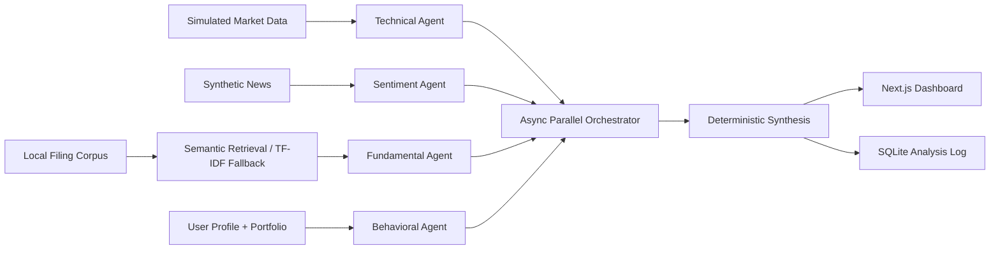

# FinSync Intelligence

FinSync Intelligence is a local-first, multi-agent financial research application for retail investors. It turns visibly simulated market data, synthetic news, local filing passages, and a stored investor profile into a traceable educational research report. It does not provide live trading, direct buy/sell instructions, or guaranteed outcomes.

## Problem and solution

Retail investors often see isolated price signals without the evidence, conflicts, suitability context, or data-quality limitations behind them. FinSync runs four independent agents concurrently, uses local semantic embeddings when a cached model is available, falls back explicitly to TF-IDF, preserves every agent result, and synthesizes only cited evidence. Optional LLM and live-market modes never replace the reliable offline demonstration.

## Architecture and data flow



1. The frontend saves a risk profile, portfolio, watchlist, and interaction context.
2. The API validates the stored user and selected symbol.
3. Local market, news, and filing fixtures are loaded without filling missing values.
4. Four deterministic base agents run through `asyncio.gather()` with timestamps, latency, evidence IDs, and per-agent failure isolation. If configured, bounded LLM refinement is validated back through the same Pydantic contract.
5. Filing queries retrieve traceable semantic chunks for revenue, profitability, debt, guidance, and risk. If the local embedding model cannot load, the response reports `tfidf_fallback`.
6. Deterministic synthesis detects agreement, conflict, and missing evidence, then adjusts confidence.
7. The complete typed response is logged in SQLite and rendered by the dashboard.

## Agent roles and decision logic

| Agent | Role | Output labels |
|---|---|---|
| Technical | Scores 5-day/20-day momentum, moving-average position, volume ratio, volatility, and drawdown. | `bullish`, `neutral`, `bearish` |
| Sentiment | Aggregates only local synthetic news records and preserves record-level attribution. | `positive`, `neutral`, `negative`, or `insufficient_data` |
| Fundamental/RAG | Classifies only text returned by the filing retriever; every claim maps to a document and chunk ID. | `strong`, `mixed`, `weak`, or `insufficient_data` |
| Behavioral | Compares volatility, horizon, risk profile, interaction history, and portfolio concentration. | `suitable`, `neutral`, `unsuitable` |

The synthesis layer maps agent classifications to deterministic directional scores. Missing agents reduce confidence by fixed penalties; conflicting directions also reduce confidence. If no cited evidence exists, synthesis returns `insufficient_data` and produces no uncited conclusion. Guidance uses educational language such as “consider,” “monitor,” and “investigate further.”

Historical accuracy is calculated only from `historical_signals.json` as correct fixture outcomes divided by evaluated fixture outcomes. The response includes both counts, and the dashboard explicitly distinguishes this small synthetic evaluation from live predictive performance.

## Retrieval and citations

`FilingRetriever` splits each local synthetic filing into paragraph chunks. When the configured local MiniLM sentence-transformer is cached, normalized semantic embeddings are persisted in `backend/app/data/filing_vectors.json` with a corpus fingerprint and queried by cosine similarity. Each result retains source ID, title, document, chunk ID, excerpt, and relevance score. If the model/dependency cannot load, the same interface uses TF-IDF and truthfully reports `tfidf_fallback`; it is never described as vector retrieval. These documents remain synthetic demonstration material.

## Persistence

SQLite stores user profiles and complete serialized `AnalysisResponse` logs. Existing databases are migrated additively for the full response JSON. The history endpoint validates and deserializes each saved response through Pydantic. New optional metric-count fields have defaults so older persisted analyses remain readable.

## Technology

- Frontend: Next.js 15, React 19, TypeScript, Tailwind CSS
- Backend: FastAPI, Pydantic, built-in `sqlite3`
- Orchestration: Python `asyncio`
- Retrieval: optional sentence-transformer semantic embeddings with a persistent JSON vector store; scikit-learn TF-IDF fallback
- Optional reasoning: OpenAI-compatible Chat Completions, bounded by timeout and Pydantic validation
- Optional live quotes: Alpha Vantage with automatic simulated-fixture fallback
- Tests: pytest, FastAPI TestClient/httpx

## Folder structure

```text
backend/
  app/agents/       Four specialist agents and shared contract exports
  app/services/     Market provider, retrieval, orchestration, synthesis, metrics
  app/routes/       Health, stocks, profiles, analysis, and logs endpoints
  app/data/         Simulated market/news/history fixtures and synthetic filings
  tests/            Agent, API, scenario, metrics, retrieval, and persistence tests
frontend/
  app/              Next.js route, metadata, icon, and responsive theme
  components/       Complete interactive dashboard
  lib/              Typed API client
  types/            Backend-aligned TypeScript response types
```

## Installation

From the repository root:

```bash
python3 -m venv .venv
source .venv/bin/activate
python -m pip install -r backend/requirements.txt
cd frontend
npm install
cd ..
cp .env.example .env
```

No API keys or external accounts are required for the offline demo. `sentence-transformers` may download a model during installation; production-style offline use should pre-cache `sentence-transformers/all-MiniLM-L6-v2`.

Runtime environment variables are documented in `.env.example`. Leave `LLM_API_KEY` and `MARKET_DATA_API_KEY` empty for deterministic/simulated operation. Set `MARKET_DATA_MODE=live` plus a valid Alpha Vantage key to attempt live quote overlays. Set `LLM_API_KEY` to enable bounded OpenAI reasoning. Secrets are read only from environment variables and must never be committed.

## Run locally

Backend terminal:

```bash
cd /Users/pavans/Desktop/sprint1
source .venv/bin/activate
cd backend
uvicorn app.main:app --reload --host 127.0.0.1 --port 8000
```

Frontend terminal:

```bash
cd /Users/pavans/Desktop/sprint1/frontend
npm run dev -- --hostname 127.0.0.1
```

Open `http://127.0.0.1:3000`. API documentation is at `http://127.0.0.1:8000/docs`.

## Tests and build

```bash
cd /Users/pavans/Desktop/sprint1/backend
../.venv/bin/pytest
../.venv/bin/python -m compileall -q app tests

cd /Users/pavans/Desktop/sprint1/frontend
npm run lint
npm run typecheck
npm run build
```

## API endpoints

| Method | Endpoint | Purpose |
|---|---|---|
| GET | `/` | API identity |
| GET | `/health` | Service health and version |
| GET | `/api/v1/stocks` | Validated simulated market snapshots |
| POST | `/api/v1/profiles` | Create or update a user profile |
| GET | `/api/v1/profiles/{user_id}` | Load a stored profile |
| POST | `/api/v1/analyze` | Run and persist the four-agent pipeline |
| GET | `/api/v1/logs/{user_id}` | Load complete saved analyses |
| POST | `/api/v1/decisions` | Persist BUY/SELL/WATCH/IGNORE/INVESTIGATE |
| GET | `/api/v1/decisions/{user_id}` | Load recent user decisions |

Example profile:

```json
{
  "user_id": "demo-user",
  "risk_profile": "conservative",
  "investment_horizon_years": 8,
  "maximum_volatility": 15,
  "portfolio": [
    {"symbol": "TCS", "weight": 70},
    {"symbol": "RELIANCE", "weight": 30}
  ],
  "watchlist": ["TCS"],
  "interaction_history": [{"action": "viewed", "symbol": "TCS"}]
}
```

Example analysis request:

```json
{"user_id": "demo-user", "symbol": "TCS"}
```

## Demonstration scenarios

- **RELIANCE — complete:** generally positive evidence, 4/4 completed agents, 100% data completeness, and traceable market/news/filing/profile sources.
- **TCS — conflict:** favorable technical momentum conflicts with weaker retrieved fundamentals and profile suitability. Confidence is reduced. Switching between conservative and aggressive profiles changes Behavioral Agent output and personalized guidance for the same market snapshot.
- **INFY — degraded:** no synthetic news records exist. Sentiment returns `unavailable` and `insufficient_data`; the other three agents complete, completeness is 75%, confidence is reduced, and missing evidence remains visible.

## Two-minute demo

1. Start both services and open the dashboard.
2. Confirm the green API status and persistent simulated-data label.
3. Save the default conservative profile and run RELIANCE to show the complete evidence path.
4. Run TCS and point out the conflict banner, agent classifications, citations, and fixture sample size.
5. Change the profile to Aggressive, save, and rerun TCS to show different suitability guidance.
6. Run INFY to demonstrate graceful degradation and missing sentiment evidence.
7. Reopen an item from Analysis History without rerunning the pipeline.

## Requirement compliance audit

| Requirement | Implementation | Demo evidence | Status |
|---|---|---|---|
| Price, volume, technical data | `market_data.json`, `market_data.py`, `/api/v1/stocks` | Three validated simulated snapshots | Complete |
| Financial document corpus | `app/data/filings/*.txt` | One synthetic multi-section filing per company | Complete |
| Semantic relevance retrieval | `services/retrieval.py` | MiniLM embeddings when locally available; explicit TF-IDF fallback | Optional semantic runtime / complete fallback |
| Multi-agent orchestration | `services/orchestrator.py` | Four results preserved through `asyncio.gather()` | Complete |
| Behavioral profiling | `agents/behavioral.py`, `/api/v1/profiles` | Conservative/aggressive TCS results differ | Complete |
| Visualization/interface | `frontend/components/Dashboard.tsx` | Responsive profile, signals, agents, evidence, metrics, history | Complete |
| Logging and persistence | `database.py`, `/api/v1/logs/{user_id}` | Complete typed responses reopen from SQLite | Complete |
| Three independent dimensions | Dashboard signal panel and agent outputs | Momentum, volume anomaly, sentiment shown separately | Complete |
| Momentum signal | `agents/technical.py` | 5/20-day returns and moving-average position | Complete |
| Volume-anomaly signal | `calculate_features`, Technical Agent | Volume ratio shown with label and explanation | Complete |
| Sentiment signal | `agents/sentiment.py` | Positive/neutral/negative or explicit unavailable | Complete |
| Labels and confidence | Shared `AgentOutput` contract | Every agent card shows both | Complete |
| Cited reasoning | `Source`, evidence arrays, reasoning trace | Claims connect to local feeds/chunks | Complete |
| RAG-grounded output | `retrieval.py`, `fundamental.py` | Fundamental claims contain retrieved chunk IDs | Complete |
| Visible attribution | Analysis `sources`; Sources panel | Title, document, date, chunk, associated agent | Complete |
| Three agents in parallel | Four agents in `run_agents` | Concurrency/failure-isolation test | Complete |
| Structured contracts | `schemas.py`, `types/analysis.ts` | Pydantic and TypeScript shapes align | Complete |
| Synthesis layer | `services/synthesizer.py` | Deterministic classification/conflict/confidence | Complete |
| Profile personalization | Behavioral Agent and synthesis guidance | Identical TCS input differs by risk profile | Complete |
| Portfolio/watchlist | Profile schema and dashboard editor | Editable holdings, allocation validation, watchlist | Complete |
| Current market signals | Snapshot and signal panels | Price, returns, average, volume, volatility, drawdown | Complete |
| Agent reasoning | Agent evidence plus `reasoning_trace` | Expandable ordered explanation | Complete |
| Execution metrics | `AnalysisMetrics` | Total/per-agent/retrieval latency, chunks, coverage, agreement, concentration, fallbacks and modes | Complete |
| User decisions | `routes/decisions.py`, SQLite | Controls and recent-decision history | Complete |
| Optional LLM agents | `services/llm_provider.py` | Runtime labels and safe deterministic fallback | Optional configuration |
| Live-data fallback | `services/market_data.py` | Provider, freshness and fallback reason | Optional live configuration / complete fallback |
| End-to-end scenario | `/api/v1/analyze`; RELIANCE | Profile → agents → synthesis → SQLite → dashboard | Complete |
| Degraded scenario | INFY missing news | 3/4, 75%, sentiment unavailable | Complete |
| Conflicting scenario | TCS fixture | Conflict banner and confidence penalty | Complete |
| No uncited conclusion | `synthesize()` guard | No sources returns `insufficient_data` | Complete |
| Architecture/logic summary | This README and Mermaid diagram | Written flow, roles, retrieval, synthesis, safety | Complete |

## Limitations and disclaimers

- All bundled market records, news, filing summaries, and historical outcomes are synthetic and visibly marked simulated.
- Fixture-based historical accuracy uses a very small sample and is not evidence of live-market predictive performance.
- The local synthetic corpus is deliberately small and is not a substitute for verified regulatory filings. Semantic mode depends on a locally available embedding model; otherwise the UI reports TF-IDF fallback.
- LLM and Alpha Vantage modes are optional and inactive without credentials. No brokerage integration, transaction execution, or external citation service is provided.
- A missing feed or agent reduces completeness and confidence; without cited evidence the system returns `insufficient_data`.

FinSync Intelligence is educational research software, not personalized financial advice. It does not guarantee returns or issue direct buy/sell instructions.
