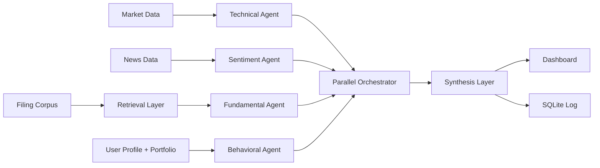

# FinSync Intelligence

FinSync Intelligence is the local-first foundation for a multi-agent financial research application for retail investors. This setup phase provides shared contracts, simulated evidence, profiles, persistence, and a compiling dashboard shell—without pretending to deliver complete investment intelligence.

## Architecture and data flow



The technical agent will evaluate deterministic momentum, volume, volatility, and drawdown features. The sentiment agent will assess visibly simulated news. The fundamental agent will retrieve filing passages before classifying evidence. The behavioral agent will compare a signal with the user's risk profile, horizon, portfolio concentration, watchlist, and interaction history. The orchestrator will run these agents concurrently with `asyncio`, tolerate partial failures, and pass completed evidence to synthesis.

Data flows from local provider fixtures and user profiles into specialized agents, then through a parallel orchestrator and evidence-aware synthesis. Results ultimately feed the Next.js dashboard and an SQLite analysis log. An optional live provider can later implement the market-data protocol without changing downstream contracts.

## Tech stack

- Next.js, TypeScript, Tailwind CSS
- FastAPI, Pydantic, built-in `sqlite3`
- Planned `asyncio` orchestration and scikit-learn TF-IDF retrieval
- pytest and httpx for backend tests

## Folder structure

```text
backend/app/       API, schemas, database, routes, agents, services, fixtures
backend/tests/     Backend health and fixture endpoint tests
frontend/app/      Next.js App Router shell and theme
frontend/components/ Typed dashboard placeholders
frontend/lib/      Environment-based API client
frontend/types/    Shared analysis contracts in TypeScript
```

## Local setup

```bash
cd backend
python3 -m venv .venv
source .venv/bin/activate
python -m pip install -r requirements.txt
cp ../.env.example .env
uvicorn app.main:app --reload --host 127.0.0.1 --port 8000
```

In a second terminal:

```bash
cd frontend
npm install
cp ../.env.example .env.local
npm run dev
```

The frontend is at `http://localhost:3000`; the API docs are at `http://localhost:8000/docs`.

## Verification commands

```bash
cd backend && source .venv/bin/activate && pytest
cd frontend && npm run lint && npm run typecheck && npm run build
```

## Shared response contract

Every agent returns an agent name, status, classification, confidence from 0–100, summary, evidence, risks, sources, latency, and warnings. The complete analysis adds identifiers and timestamps, profile and market state, synthesis, deduplicated sources, a reasoning trace, completeness/accuracy/concentration/latency metrics, warnings, and a disclaimer. Enums and field shapes are defined in `backend/app/schemas.py` and mirrored in `frontend/types/analysis.ts`.

## Three-hour developer division

- Developer 1: agent implementations, TF-IDF retrieval, parallel orchestration, synthesis, deterministic metrics, and analysis logging.
- Developer 2: profile workflow, portfolio/watchlist state, stock selection, agent/synthesis cards, warnings, sources, metrics, and basic Recharts visualization if time permits.
- Both: verify shared schema changes on both sides and keep the demo runnable.

## Requirement checklist

- [x] Local Next.js/FastAPI monorepo foundation with no paid services or Docker
- [x] Root, health, stocks, profile create/read, and safe placeholder routes
- [x] CORS, environment configuration, SQLite initialization, typed contracts
- [x] Simulated RELIANCE, conflicting TCS, and incomplete INFY fixtures
- [x] Synthetic filings and historical signal outcomes
- [x] Market-provider boundary and placeholders for four agents/services
- [x] Frontend health indicator, API client, shared types, and UI placeholders
- [ ] Implement agent intelligence and parallel failure-tolerant orchestration
- [ ] Implement filing retrieval, synthesis, metrics, and analysis logging
- [ ] Build functional profile, portfolio, watchlist, analysis, and visualization UX
- [ ] Measure historical accuracy and portfolio concentration in the live flow

## Disclaimers

All bundled market records, news, filing summaries, and historical outcomes are synthetic and visibly marked as simulated. They are not real articles, company filings, live quotes, or external citations.

FinSync Intelligence presents educational research intelligence, not personalized financial advice. It does not issue guaranteed outcomes or direct buy/sell instructions. Missing or unverified evidence must reduce confidence and may require an `insufficient_data` result.
